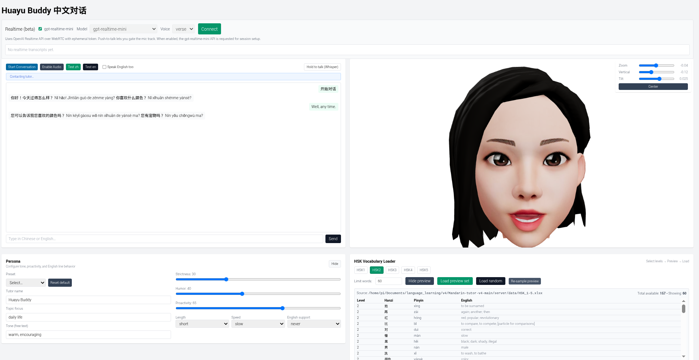

# Huayu Buddy — Chinese Conversation Tutor

A comprehensive Mandarin Chinese learning application featuring real-time conversation practice with AI tutoring, 3D avatar visualization, and multi-platform support.

## ✨ Features

- 🗣️ **Spoken Responses**: OpenAI TTS with browser TTS fallback
- 👤 **3D Avatar**: Head-only model with lip-sync (viseme) and natural blinking
- 📝 **Multi-Script Display**: Pinyin, Hanzi (Chinese characters), and optional English translations
- 📚 **HSK Integration**: Selectable vocabulary levels (HSK 1-5) with review tables
- 🔍 **Diagnostics**: Built-in health checks and system monitoring
- 🎙️ **WebRTC Realtime**: Optional streaming chat with `gpt-4o-realtime-preview` or `gpt-realtime-mini`
- 💻 **Cross-Platform**: Web app + Electron desktop application

---

## 🚀 Quick Start

### Prerequisites

Install nodemon globally:

```bash
npm install -g nodemon
```

### Development Server

Start the development server with your OpenAI API key:

```bash
OPENAI_API_KEY=sk-your_key_here npm run dev
```

The application will be available at `http://localhost:3000`

---

## 🎤 Realtime WebRTC Panel

Uses OpenAI's WebRTC streaming for natural, low-latency conversations.

### Getting Started

1. Click **Connect** to request an ephemeral session token from `/api/realtime-session`
2. The app establishes a WebRTC peer connection automatically

### Configuration Options

#### Model Selection

- **Default**: `gpt-4o-realtime-preview` (standard/mini variants)
  - Full feature set with custom voice selection
- **Lightweight**: Toggle `gpt-realtime-mini` for faster responses
  - Voice selection automatically disabled (not supported by mini)

> ⚠️ **Important**: Disconnect before switching models or toggling options

## 🎤 OpenAI TTS with browser TTS fallback

- Click **Start Conversation** to begin. 
- **Hold to Talk (Whisper)** controls the microphone. 

## 💻 Electron Desktop App

Bundle the entire application into a standalone desktop executable with integrated Express API.

### Development Mode

Run both the React UI and API server, then launch Electron:

```bash
OPENAI_API_KEY=sk-your_key_here npm run electron:dev
```

**What happens:**
- React dev server starts on `:3000`
- Express API starts on `:8787`
- Electron window launches once both servers are ready

### Testing Production Build

Test the packaged experience without creating an installer:

```bash
OPENAI_API_KEY=sk-your_key_here npm run electron:start
```

Builds the React app and runs Electron against the embedded Express server.

### Building Portable Executable

Create a Windows `.exe` installer:

```bash
npm run electron:build
```

**Output**: `dist/HuayuBuddy-<version>.exe`

**Features:**
- No console window
- Internal Express server on `127.0.0.1`
- Self-contained (no external dependencies)

---

## 🔧 Configuration

### Platform-Specific Notes

#### Windows
- Run `electron:build` directly for native packaging
- No additional dependencies required

#### Linux
- Development mode disables Electron sandbox automatically
- No `chrome-sandbox` setuid permissions needed
- Production builds may require Wine for cross-platform packaging

#### macOS
- Standard Electron development workflow
- May require additional signing for distribution

---

## 📁 Project Structure

```
huayu-buddy/
├── src/                    # React application source
├── public/                 # Static assets
├── electron/               # Electron main process
├── server/                 # Express API backend
├── dist/                   # Built executables
└── README.md
```

---

## 🛠️ Development Commands

| Command | Description |
|---------|-------------|
| `npm run dev` | Start web development server |
| `npm run electron:dev` | Start Electron development mode |
| `npm run electron:start` | Test production Electron build |
| `npm run electron:build` | Package Windows portable executable |

---

## 🐛 Troubleshooting

### Realtime Panel Issues

- **Connection fails**: Verify `OPENAI_API_KEY` is valid
- **No audio**: Check browser microphone permissions
- **Voice not working**: Ensure `gpt-realtime-mini` toggle is OFF for custom voices

### Electron Build Issues

- **Windows packaging fails**: Run on Windows or install Wine
- **Sandbox errors (Linux)**: Development mode disables sandbox automatically
- **API key not found**: Set environment variables before launching the executable

---

## 📚 Learning Resources

### HSK Levels

- **HSK 1**: 150 words (basic conversations)
- **HSK 2**: 300 words (simple daily topics)
- **HSK 3**: 600 words (basic fluency)
- **HSK 4**: 1,200 words (intermediate topics)
- **HSK 5**: 2,500 words (advanced discussions)

---

## 🤝 Contributing

Contributions welcome! Please ensure:

1. OpenAI API calls are properly error-handled
2. Electron builds work on all target platforms
3. 3D avatar lip-sync is synchronized with TTS
4. HSK vocabulary data is accurate

---

## 📄 License


---

## 🔗 Related Documentation

- [OpenAI Realtime API](https://platform.openai.com/docs/guides/realtime)
- [Electron Documentation](https://www.electronjs.org/docs)
- [HSK Standard](https://en.wikipedia.org/wiki/Hanyu_Shuiping_Kaoshi)

---

**Built with**: React, Express, Electron, OpenAI API, Three.js
