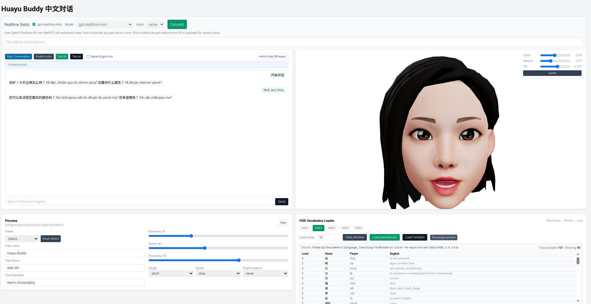

# Huayu Buddy — Chinese Conversation Tutor

A comprehensive Mandarin Chinese learning application featuring real-time conversation practice with AI tutoring, 3D avatar visualization, and multi-platform support.

### Core Learning Features

- 🗣️ **Real spoken practice** – hold-to-talk microphone input, get instant spoken responses in natural Mandarin using OpenAI TTS, with browser TTS fallback when needed. Optional streaming chat with `gpt-4o-realtime-preview` or `gpt-realtime-mini`
- 👤 **3D tutor avatar** – head-only 3D model with lip-sync visemes and natural blinking, so it feels like you’re talking to a real tutor.
- 📝 **Multi-script display** – see Hanzi, Pinyin (with tone marks), and optional English translations so you can adapt to your level.
- 📚 **HSK-focused practice** – choose HSK 1–5 word lists to shape the conversation topics and review vocab in built-in tables.

## 🎓 How to Use Huayu Buddy to Learn

1. Pick your **HSK level** and optionally a topic (e.g., ordering food, travel, work).
2. Click **Start Conversation**, hold the **Hold to Talk** button, and speak in Mandarin or English.
3. The AI tutor responds in Mandarin (with audio) or optionally both Mandarin and English, plus Hanzi + Pinyin subtitles.
4. Use the **HSK Review** tab to revisit words that came up in your conversation.
---

## 🧩 Installation

1. Clone this repo:
```bash
   git clone https://github.com/pwobus/Mandarin-tutor-v4
   cd huayu-buddy
```
Install dependencies:
```bash
npm install
```
(Optional) Install nodemon globally:

```bash
npm install -g nodemon
```

```md
Create a `.env` file in the project root:

```bash
OPENAI_API_KEY=sk-your_key_here

Start the development server:

```bash
npm run dev
```

The application will be available at `http://localhost:3000`

---
## 🏗️ Architecture Overview

- **React UI (`/src`)**
  - Conversation UI, HSK vocab browser, 3D avatar using Three.js
  - Realtime panel for WebRTC-based chat

- **Express API (`/server`)**
  - `/api/realtime-session` – issues ephemeral Realtime API tokens
  - `/api/tts` – optional REST wrapper for text-to-speech
  - Health check + diagnostics endpoints

- **Electron wrapper (`/electron`)**
  - Bundles React + Express into a single desktop app
  - Manages local window, tray, and packaging

- **Assets (`/public`)**
  - Avatar models, textures, screenshots, and static files

### Realtime vs. TTS

- **Realtime WebRTC panel**
  - Streaming conversation with low latency
  - Uses `gpt-4o-realtime-preview` or `gpt-realtime-mini`
  - Best for “hands-free” back-and-forth speaking practice

- **Standard TTS flow and STT using Wisper, OPENAI's automatic speech recognition system**
  - Speak or send a text prompt, get back a synthesized audio reply
  - Slightly higher latency, simpler to debug
  - Backed by OpenAI TTS with browser TTS as fallback


---

## 💻 Electron Desktop App

Bundle the entire application into a standalone desktop executable with integrated Express API.

### Development Mode

Run both the React UI and API server, then launch Electron:

```bash
npm run electron:dev
```

**What happens:**
- React dev server starts on `:3000`
- Express API starts on `:8787`
- Electron window launches once both servers are ready


### Testing Production Build

Test without creating an installer:

```bash

npm run electron:start
```

Builds the React app and runs Electron against the embedded Express server.

### Building Portable Executable

Create a Windows `.exe` installer:

```bash
npm run electron:build
```

**Output**: `dist/HuayuBuddy-<version>.exe`

**Features:**
- No console window
- Internal Express server on `127.0.0.1`
- Self-contained (no external dependencies)

---

### Platform-Specific Notes

#### Windows
- Run `electron:build` directly for native packaging
- No additional dependencies required

#### Linux
- Development mode disables Electron sandbox automatically
- No `chrome-sandbox` setuid permissions needed
- Production builds may require Wine for cross-platform packaging
- Runs well on a raspberry pi

#### macOS
- Standard Electron development workflow
- May require additional signing for distribution

---

## 📁 Project Structure

```
huayu-buddy/
├── src/                    # React application source
├── public/                 # Static assets
├── electron/               # Electron main process
├── server/                 # Express API backend
├── dist/                   # Built executables
└── README.md
```

---

## 🛠️ Development Commands

| Command | Description |
|---------|-------------|
| `npm run dev` | Start web development server |
| `npm run electron:dev` | Start Electron development mode |
| `npm run electron:start` | Test production Electron build |
| `npm run electron:build` | Package Windows portable executable |

---

## 🐛 Troubleshooting

### Realtime Panel Issues

- **Connection fails**: Verify `OPENAI_API_KEY` is valid
- **No audio**: Check browser microphone permissions
- **Voice not working**: Ensure `gpt-realtime-mini` toggle is OFF for custom voices

### Electron Build Issues

- **Windows packaging fails**: Run on Windows or install Wine
- **Sandbox errors (Linux)**: Development mode disables sandbox automatically
- **API key not found**: Set environment variables before launching the executable

---

## 📚 Learning Resources

### HSK Levels

- **HSK 1**: 150 words (basic conversations)
- **HSK 2**: 300 words (simple daily topics)
- **HSK 3**: 600 words (basic fluency)
- **HSK 4**: 1,200 words (intermediate topics)
- **HSK 5**: 2,500 words (advanced discussions)

---
## 📄 License

MIT © 2025 pwobus

## 🤝 Contributing

## 🗺️ Roadmap

- [ ] HSK 6 vocab integration
- [ ] Session history + spaced repetition review
- [ ] Per-user progress tracking
- [ ] More avatar styles and camera angles

---

## 🔗 Related Documentation

- [OpenAI Realtime API](https://platform.openai.com/docs/guides/realtime)
- [Electron Documentation](https://www.electronjs.org/docs)
- [HSK Standard](https://en.wikipedia.org/wiki/Hanyu_Shuiping_Kaoshi)

---

**Built with**: React, Express, Electron, OpenAI API, Three.js
